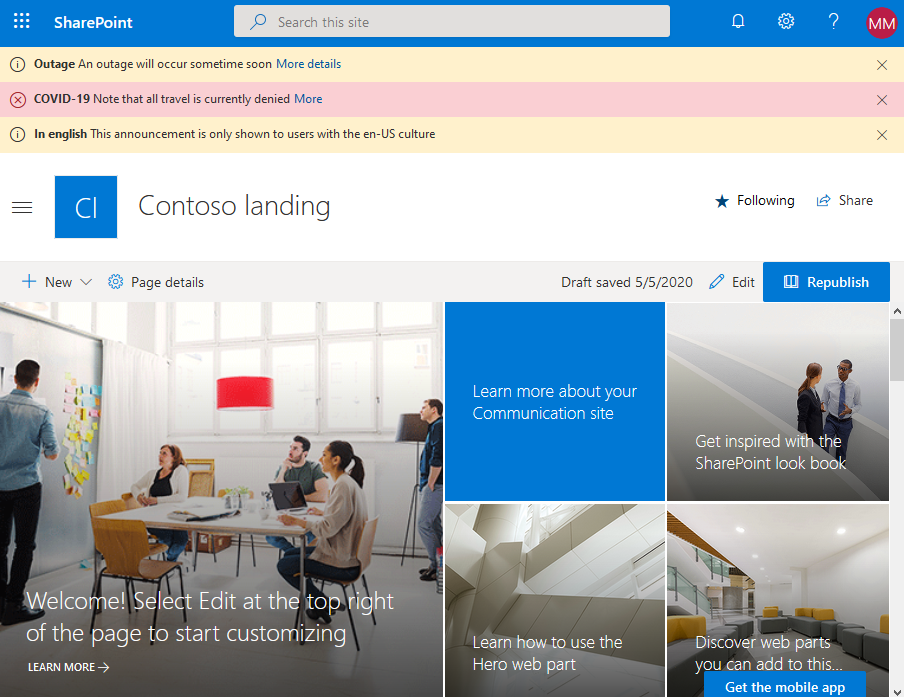

# Announcements SharePoint Framework Application Customizer

## Summary
SharePoint Framework application customizer displaying an information banner using office-fabric-ui MessageBar.

Inspired by react-app-announcements by Waldek Mastykarz (MVP, [Rencore](https://rencore.com), @waldekm), 
js-application-alert-message Sudharsan K.(@sudharsank, Know More) and 
the sp-starter-kit alertNotification component.



## Used SharePoint Framework Version 


## Applies to

* [SharePoint Framework](https://dev.office.com/sharepoint)
* [Office 365 tenant](https://dev.office.com/sharepoint/docs/spfx/set-up-your-development-environment)

## Solution

Solution|Author(s)
--------|---------
react-application-announcements | Martin Cyr (martin.cyr@metalogique.com)

## Version history

Version|Date|Comments
-------|----|--------
2.0|May 20th, 2020|Initial release

## Disclaimer
**THIS CODE IS PROVIDED *AS IS* WITHOUT WARRANTY OF ANY KIND, EITHER EXPRESS OR IMPLIED, INCLUDING ANY IMPLIED WARRANTIES OF FITNESS FOR A PARTICULAR PURPOSE, MERCHANTABILITY, OR NON-INFRINGEMENT.**

---

## Minimal Path to Awesome

- Clone this repository
- Create the announcements list in SharePoint
- `npm install`
- `gulp serve`
- Open a browser on a sharepoint site having the approprive announcements list and append this query string to the url (remember to change the siteUrl and listName!)
```
?loadSPFX=true&debugManifestsFile=https://localhost:4321/temp/manifests.js&customActions={"dd7ec4fd-97aa-44c5-b6ad-87535862e0bf":{"location":"ClientSideExtension.ApplicationCustomizer","properties":{"listName":"Annoncements","siteUrl": "/sites/Contoso"}}}
```

### Announcemenmts list columns
The Announcements list must have the following columns. Also note that a PnP Provisioning template is provided in sharepoint/assets/pnptemplate.xml that can (and should!) be used to deploy the list.
Column|Type|Values
------|----|------
Locale|Choice|en-US, fr-FR, ...
Announcement|Note|
Link|URL|
Urgent|Boolean|
StartDateTime|DateTime|
EndDateTime|DateTime|

### Build and deploy
  - `gulp build --ship`
  - `gulp bundle --ship`
  - `gulp package-solution --ship`
  - Deploy the app package (sharepoint/solution/package.spkg) to your tenant AppCatalog
  - Deploy a list with the appropriate fields
  - Add the extension custom action with the appropriate settings

### Using PnPPowerShell

To deploy the announcements list and add the custom action to your desired site, the easiest solution is using PnPPowerShell.

1. Install PnPPowerShell `Install-Module SharePointPnPPowerShellOnline`
1. Connect to your site `Connect-PnPOnline https://MyTenant.sharepoint.com/sites/MySite`
1. Deploy the PnP Provisioning template `Apply-PnPProvisioningTemplate sharepoint\assets\pnptemplate.xml -Handlers Fields,ContentTypes,Lists`
1. Add the custom action (remember to replace Contoso in the ClientSideComponentProperties by your site name) `Add-PnPCustomAction -Name "Announcements" -Title "Annoncements" -Location "ClientSideExtension.ApplicationCustomizer" -ClientSideComponentId "dd7ec4fd-97aa-44c5-b6ad-87535862e0bf" -ClientSideComponentProperties="{&quot;listName&quot;:&quot;Annoncements&quot;, &quot;siteUrl&quot;:&quot;/sites/Contoso&quot;}"`

Also, note that the template file also includes an example on how to deploy an extension on a site. This requires the app to be deployed to the app catalog

## Features
This extension illustrates the following concepts:

- SPFX Extensions and Application Customizers
- React (with Hooks)
- Office Fabric UI React
- PnPJS
- PnP Provisioning templates
- Custom actions
- PnPPowerShell


