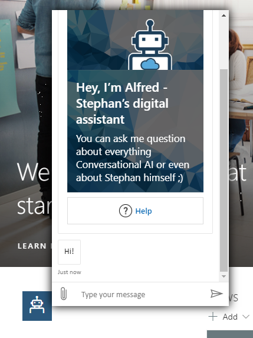

# Bot Framework Chat React App Customizer

## Summary
SPFx application extension that uses the [Bot Framework React Webchat Component](https://www.npmjs.com/package/botframework-webchat#integrate-with-react) to render a Bot Framework chat window



## Used SharePoint Framework Version


## Applies to

* [SharePoint Framework Extensions](https://dev.office.com/sharepoint/docs/spfx/extensions/overview-extensions)

## Solution

Solution|Author(s)
--------|---------
react-application-botframework-chat|[Stephan Bisser](https://bisser.io) - [@stephanbisser](https://twitter.com/stephanbisser)

## Version history

Version|Date|Comments
-------|----|--------
1.0.0|October 19, 2019|Initial release

## Disclaimer

**THIS CODE IS PROVIDED *AS IS* WITHOUT WARRANTY OF ANY KIND, EITHER EXPRESS OR IMPLIED, INCLUDING ANY IMPLIED WARRANTIES OF FITNESS FOR A PARTICULAR PURPOSE, MERCHANTABILITY, OR NON-INFRINGEMENT.**

---

## Prerequisites

* Office 365 tenant with a modern site collection 
* Bot Framework Bot with a Direct Line key ([more info on how to establish this here](https://docs.microsoft.com/en-us/azure/bot-service/bot-service-channel-connect-directline?WT.mc_id=AI-MVP-5003073))

## Minimal Path to Awesome

* clone this repo
* edit "BotFrameworkChatPopupApplicationChat.tsx" file to set your Direct Line API Key directly (instead of setting it in the Tenant Wide Extensions list):

```ts
this.state = {
    directLine: new DirectLine({
    secret: this.props.directLineSecret //change this to the key directly if you want to test it
    }),
```

* in the command line run
  * `npm i`
  * `gulp serve-info --nobrowser`

```
?loadSPFX=true&debugManifestsFile=https://localhost:4321/temp/manifests.js&customActions={"f50b07b5-76a5-4e80-9cab-b4ee9a591bf6":{"location":"ClientSideExtension.ApplicationCustomizer"}}
```
If you want to deploy it follow the steps [here](https://docs.microsoft.com/en-us/sharepoint/dev/spfx/extensions/get-started/hosting-extension-from-office365-cdn) and add the following properties to the "Component Properties" column in the Tenant Wide Extensions List:

```json
{"allowedSites":["https://yourTenant.sharepoint.com/sites/abc"], "directLineSecret":"yourDirectLineSecret"}
```

## Features

Sample SharePoint Framework application extension.

This sample illustrates the following concepts on top of the SharePoint Framework:

* using the Bot Framework webchat React component as some kind of flyout webpart in modern pages
* adding a bot to modern pages and let users interact with a bot hosted in the Azure Bot Service